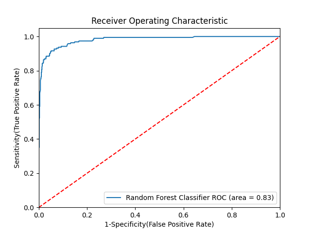

# 🧳 Holiday Package Purchase Prediction

## 📝 Problem Statement

**Trips & Travel.Com** aims to grow its customer base by launching a new **Wellness Tourism Package** — travel that enhances a healthy lifestyle and well-being. Previously, only 18% of contacted customers purchased packages, and the marketing approach was inefficient due to random targeting.

To make marketing more cost-effective, the company now intends to utilize historical customer data to predict which potential customers are more likely to purchase a package.

---

## 📊 Dataset

- Source: [Kaggle - Holiday Package Purchase Prediction](https://www.kaggle.com/datasets/susant4learning/holiday-package-purchase-prediction)
- Rows: 4,888
- Columns: 20

---

## 🧼 Data Preprocessing

### ✔ Handling Missing Values

- **Imputed Median** for:
  - Age
  - DurationOfPitch
  - NumberOfTrips
  - MonthlyIncome
- **Imputed Mode** for:
  - TypeOfContact
  - NumberOfFollowups
  - PreferredPropertyStar
  - NumberOfChildrenVisiting

### 🧠 Feature Engineering

- One-Hot Encoding for categorical variables
- StandardScaler for numerical features
- ColumnTransformer to combine transformations

---

## 🧪 Model Building

**Model Used:** Random Forest Classifier

### 🔧 Tuning

- **Hyperparameter Optimization:** `RandomizedSearchCV`

---

## 📈 Model Performance

### ✅ Base Random Forest

**Training Set**
- Accuracy: **1.0000**
- F1 Score: **1.0000**
- Precision: **1.0000**
- Recall: **1.0000**
- ROC AUC: **1.0000**

**Test Set**
- Accuracy: **0.9223**
- F1 Score: **0.9155**
- Precision: **0.9675**
- Recall: **0.6230**
- ROC AUC: **0.8090**

---

### 🔍 Tuned Model (RandomizedSearchCV)

**Training Set**
- Accuracy: **1.0000**
- F1 Score: **1.0000**
- Precision: **1.0000**
- Recall: **1.0000**
- ROC AUC: **1.0000**

**Test Set**
- Accuracy: **0.9366**
- F1 Score: **0.9326**
- Precision: **0.9640**
- Recall: **0.7016**
- ROC AUC: **0.8476**

---

## 🧩 ROC AUC Curve

AUC Curve has been plotted to visually inspect model performance across various threshold values.

